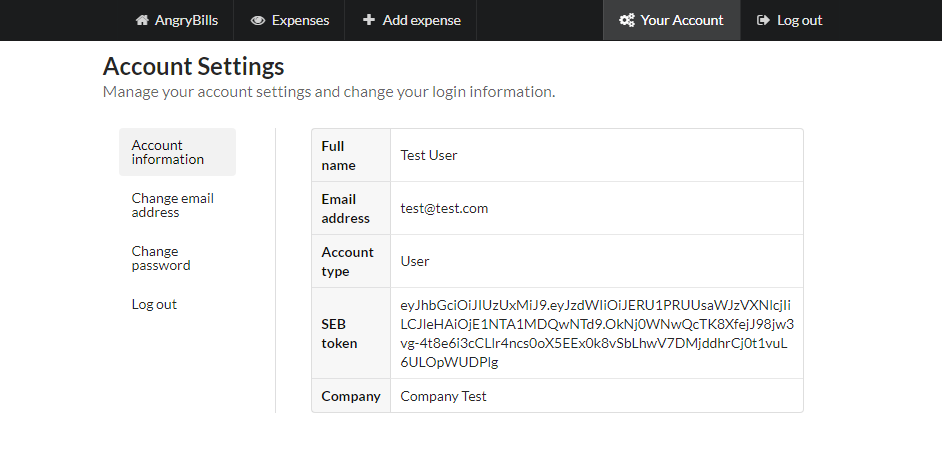

# AngryBills
With an ability to view and share transaction logs of expenses made with the employer, which we tested based on SEB’s API, our app allows you in addition to instant sharing your expenses information to the employer, simultaneously trigger the refund transaction, which covers your expenses. It makes you happier due to receiving your personal earlier and decreasing the headache for accountants within you firm.  
Project was developed during _Garage48 Open Banking hackaton_.
  
**Additional files:**
* <a href="documentation/market_analysis.docx">Market analysis</a>
* <a href="documentation/pitch_draft.docx">Pitch draft</a>

## Technology stack
* Flask with Python 3 (backend)
* Jinja2 (frontend)
* PostgreSQL (database)
* Semantic UI (styles)
* Heroku (server)
* [SEB API](https://developer.baltics.sebgroup.com/)

## Test credentials
**User account**  
**Email:** test@test.com  
**Password:** test123
  
**Company account**  
**Email:** company@test.com  
**Password:** test123

## Team photo:


## Screen shoots
### Registration

  
### Account settings

  
### All expenses
  

### Add expense
  

### Incoming requests (company view)
  


## Setting up
Set your environment variables in config.env  
```cp config.env.example config.env```   

Also, you need to create a new APP_KEY and update corresponding env variable APP_KEY.    
Additionally, `FLASK_CONFIG` env. variable can be changed to `development`, `production`, `default`, `heroku`, `unix`, or `testing`.
  
Install the dependencies  
```pip install -r requirements.txt```

Create database, seeding fake data  
```python manage.py setup_dev```

Run the app  
```python manage.py runserver```

#### Created from starter-pack
Documentation for the starter-pack we used is available at [http://hack4impact.github.io/flask-base](http://hack4impact.github.io/flask-base).
